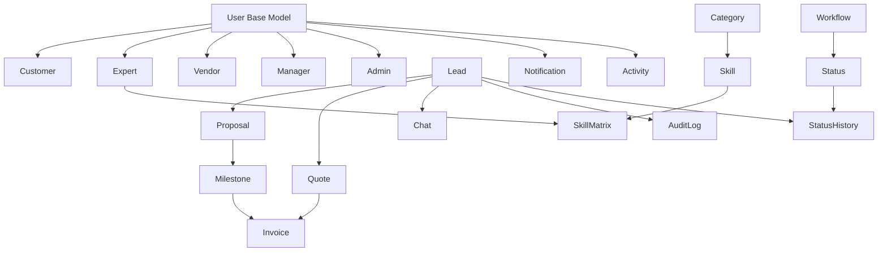

# Sustentus Database Structure Documentation

## Overview

This document provides a comprehensive analysis of the Sustentus database structure, including all models, their relationships, and how they interconnect. This documentation is designed to enable another AI tool or developer to quickly understand the database architecture and create UI components based on the data structure.

## Database Technology Stack

- **Database**: MongoDB
- **ODM**: Mongoose
- **Connection**: MongoDB Atlas/Cloud
- **Additional Storage**: Redis (for caching and session management)

## Core Architecture Patterns

### 1. User Discriminator Pattern
The system uses Mongoose discriminators to extend a base `User` model with role-specific schemas:
- **Base User Model**: Common fields for all user types
- **Discriminators**: Customer, Expert, Vendor, Manager, Admin
- **Discriminator Key**: `role` field determines the user type

### 2. Workflow Management System
- **Status Model**: Defines workflow states with hierarchical structure (master/substatus)
- **Workflow Model**: Defines complete workflow graphs with nodes and edges
- **StatusHistory Model**: Tracks all status transitions with audit trail

### 3. Soft Delete Pattern
Most models implement soft deletion using a custom plugin that adds `isDeleted` and `deletedAt` fields.

## Model Relationships Map

## Detailed Model Analysis

### Core User Models

#### 1. User (Base Model)
**File**: `models/user.js`
**Type**: Base discriminator model

**Key Fields**:
- `role`: Enum ['vendor', 'expert', 'customer', 'admin', 'manager']
- `email`: Unique, required, lowercase
- `password`: Hashed with Argon2, select: false
- `personalCode`: Unique 6-character code
- `master`: Reference to parent user (for vendor hierarchy)
- `isActive`: Boolean, default false
- `isMaster`: Boolean, default true
- `verification`: Object with email, phone, proofOfId, proofOfAddress verification status
- `notificationPreferences`: Email, push, SMS preferences
- `bankDetails`: Name, account number, bank code, tax number
- `location`: Country, state, street, zipCode, region, territory

**Relationships**:
- Self-referential: `master` field for vendor hierarchy
- Referenced by: All other models that need user information

#### 2. Customer
**File**: `models/customer.js`
**Type**: User discriminator

**Additional Fields**:
- `vendor`: Reference to assigned vendor
- `industry`: String
- `lastContact`: Date

**Relationships**:
- References: Vendor (assigned vendor)
- Referenced by: Lead, Quote, Invoice

#### 3. Expert
**File**: `models/expert.js`
**Type**: User discriminator

**Additional Fields**:
- `position`: String
- `bio`: String
- `products`: Array of Product references

**Relationships**:
- References: Product (expert's products)
- Referenced by: Lead, Proposal, Quote, Invoice, Milestone, SkillMatrix

#### 4. Vendor
**File**: `models/vendor.js`
**Type**: User discriminator

**Additional Fields**:
- `jobTitle`: String
- `type`: String

**Business Logic**:
- Pre-save hook limits number of master/staff vendors based on Settings

**Relationships**:
- Referenced by: Customer, Lead, Quote, Invoice

#### 5. Manager
**File**: `models/manager.js`
**Type**: User discriminator

**Additional Fields**:
- `inHouse`: Boolean, default false
- `managerType`: Enum ['cs-manager', 'sd-manager'], default 'cs-manager'

**Relationships**:
- Referenced by: Lead, Quote, Invoice

#### 6. Admin
**File**: `models/admin.js`
**Type**: User discriminator

**Additional Fields**:
- `inHouse`: Boolean, default false

### Business Process Models

#### 7. Lead
**File**: `models/lead.js`
**Type**: Core business entity

**Key Fields**:
- `requestId`: Auto-incremented number (SU prefix)
- `category`: String, required
- `description`: String
- `requirements`: String
- `skills`: Array of Skill references
- `budget`: Array
- `startDate`, `endDate`, `bidDeadline`: Dates
- `product`: Product reference
- `manager`, `expert`, `vendor`, `customer`: User references
- `status`: Status reference
- `licenses`: Number
- `bidPool`: Boolean, default false
- `isActiveProject`: Boolean, default false
- `attachments`: Array of file objects
- `createdBy`, `updatedBy`: User references

**Business Logic**:
- Auto-generates requestId using Counter model
- Auto-sets initial status from Workflow
- Creates Chat automatically on creation
- Triggers AI workflow when moved to 'backlog' status
- Comprehensive audit logging on updates

**Relationships**:
- References: Product, Manager, Expert, Vendor, Customer, Status, Skill, User (createdBy/updatedBy)
- Referenced by: Proposal, Quote, Invoice, Chat, AuditLog, StatusHistory

#### 8. Proposal
**File**: `models/proposal.js`
**Type**: Bid proposal from expert

**Key Fields**:
- `lead`: Lead reference, required
- `title`: String, required
- `price`: Number, required, min 0
- `startDate`, `endDate`: Dates, required
- `summary`: String
- `remarks`: String, max 1000 chars
- `xeroQuoteId`: String
- `createdBy`: Expert reference, required
- `status`: Status reference
- `isActive`: Boolean, default true
- `isDraft`: Boolean, default true

**Business Logic**:
- Auto-sets status to 'proposal_submitted' on creation
- Unique constraint on (lead, createdBy)

**Relationships**:
- References: Lead, Expert (createdBy), Status
- Referenced by: Quote, Milestone

#### 9. Quote
**File**: `models/quote.js`
**Type**: Formal quote document

**Key Fields**:
- `quoteId`: Auto-generated string (QU prefix)
- `lead`: Lead reference, required
- `expert`, `manager`, `customer`: User references
- `vendor`: Optional vendor reference
- `amount`: Number, min 0
- `serviceFee`: Number, calculated from Settings
- `proposal`: Proposal reference, required
- `currency`: Enum ['EUR', 'USD', 'GBP'], default 'EUR'
- `status`: Status reference
- `pdf`: String (Xero PDF URL)
- `xero`: Object (Xero integration data)
- `total`: Number, min 0

**Business Logic**:
- Auto-calculates serviceFee from Settings on creation
- Unique constraint on (lead, proposal)

**Relationships**:
- References: Lead, Expert, Manager, Customer, Vendor, Proposal, Status
- Referenced by: Invoice

#### 10. Invoice
**File**: `models/invoice.js`
**Type**: Payment invoice

**Key Fields**:
- `quote`: Quote reference, required
- `milestone`: Milestone reference, required
- `serviceFee`, `amount`, `total`: Numbers
- `customer`, `manager`, `expert`: User references
- `vendor`: Optional vendor reference
- `lead`: Lead reference, required
- `status`: Status reference
- `pdf`: String (PDF URL)
- `paid`: Boolean, default false
- `paidAt`: Date (required if paid)
- `isApproved`: Boolean, default false
- `xero`: Object (Xero integration data)

**Business Logic**:
- Unique constraint on milestone
- Validates paidAt is set when paid is true

**Relationships**:
- References: Quote, Milestone, Customer, Manager, Expert, Vendor, Lead, Status
- Referenced by: Milestone (circular reference)

#### 11. Milestone
**File**: `models/milestone.js`
**Type**: Project milestone

**Key Fields**:
- `type`: Enum ['time', 'event']
- `order`: Number, required, min 1
- `name`: String, required
- `description`: String
- `percentage`: Number, required, min 0, max 100, must be whole number
- `invoice`: Invoice reference
- `expert`: Expert reference, required
- `proposal`: Proposal reference, required

**Business Logic**:
- Unique constraint on (proposal, order)
- Static method to validate milestone percentages sum to 100

**Virtual Fields**:
- `isPaid`: Returns invoice.paid
- `isApproved`: Returns invoice.isApproved
- `amount`: Calculates proposal.price * (percentage / 100)

**Relationships**:
- References: Invoice, Expert, Proposal
- Referenced by: Invoice (circular reference)

### Communication Models

#### 12. Chat
**File**: `models/chat.js`
**Type**: Real-time messaging

**Key Fields**:
- `lead`: Lead reference, required
- `participants`: Array of {user, role} objects
- `participantsKey`: Auto-generated unique key
- `messages`: Array of MessageSchema subdocuments
- `status`: Enum ['active', 'archived'], default 'active'
- `aiConversationState`: Object with AI workflow state

**Message Subdocument Fields**:
- `sender`: Mixed (ObjectId or 'ai' string)
- `content`: String, required
- `type`: Enum ['human', 'ai', 'system', 'manager', 'customer']
- `timestamp`: Date, default now
- `read`: Boolean, default false
- `readBy`: Array of user references
- `metadata`: Mixed object
- `attachments`: Array of file objects

**Business Logic**:
- Unique constraint on (lead, participantsKey)
- Auto-generates participantsKey from sorted participant user IDs
- Auto-updates updatedAt on save

**Relationships**:
- References: Lead, User (participants)
- Referenced by: None

#### 13. Notification
**File**: `models/notification.js`
**Type**: Multi-channel notifications

**Key Fields**:
- `key`: String, required, indexed
- `title`: String, required, max 100 chars
- `message`: String, max 500 chars
- `recipients`: Array of user references
- `sender`: User reference
- `type`: Enum ['info', 'warning', 'error', 'success', 'system']
- `priority`: Enum ['low', 'medium', 'high', 'urgent']
- `channels`: Array of ['email', 'browser']
- `emailContent`: Object with subject, body, actions
- `browserContent`: Object with message, actions
- `actions`: Array of action objects
- `redirectionLink`: String
- `metadata`, `data`: Mixed objects
- `deliveryStatus`: Object with email/browser delivery tracking
- `isRead`: Boolean, default false
- `expiresAt`: Date, indexed

**Business Logic**:
- Comprehensive static methods for sending, marking as read, delivery tracking
- Auto-sets expiration to 30 days if not provided
- Tracks delivery status for each channel

**Relationships**:
- References: User (recipients, sender)
- Referenced by: None

### Skill Management Models

#### 14. Category
**File**: `models/category.js`
**Type**: Skill categorization

**Key Fields**:
- `name`: String, required, unique, lowercase
- `description`: String, max 500 chars
- `isActive`: Boolean, default true
- `isMandatory`: Boolean, default false
- `metadata`: Map of mixed values

**Business Logic**:
- Static methods for finding active/mandatory categories
- Instance methods for getting skills and skill count

**Relationships**:
- Referenced by: Skill

#### 15. Skill
**File**: `models/skill.js`
**Type**: Individual skills

**Key Fields**:
- `name`: String, required, unique, lowercase
- `description`: String, max 500 chars
- `category`: Category reference, required
- `isActive`: Boolean, default true
- `metadata`: Map of mixed values

**Business Logic**:
- Static methods for finding skills by category, active skills, findOrCreate
- Instance methods for getting skill matrix entries, expert count, average rankings

**Relationships**:
- References: Category
- Referenced by: SkillMatrix, Lead (skills array)

#### 16. SkillMatrix
**File**: `models/skillmatrix.js`
**Type**: Expert skill ratings

**Key Fields**:
- `skill`: Skill reference, required
- `expert`: Expert reference, required
- `selfRanking`: Number, required, min 1, max 10
- `systemRanking`: Number, min 1, max 10
- `verification`: Object with verified, pending, verifiedAt, performedBy, rejectionReason
- `yearsOfExperience`: Number, required, min 0
- `lastUpdated`: Date, default now
- `metadata`: Map of mixed values

**Business Logic**:
- Unique constraint on (skill, expert)
- Static methods for getting expert skills, skill experts, pending approvals
- Instance methods for approve, reject, updateSelfRanking

**Relationships**:
- References: Skill, Expert, User (verification.performedBy)
- Referenced by: None

### Workflow Management Models

#### 17. Status
**File**: `models/status.js`
**Type**: Workflow states

**Key Fields**:
- `name`: String, required, unique, lowercase
- `displayName`: String, required
- `colorCode`: String, required
- `isSubstatus`: Boolean, default false
- `parentStatus`: String (parent status name)
- `isPositive`: Boolean, default true
- `description`: String
- `isActive`: Boolean, default true
- `metadata`: Map of mixed values
- `tags`: Array of strings

**Business Logic**:
- Static methods for findByDisplayName, findIdByName, getSubstatuses, getActive
- Instance methods for isMaster, isSub
- Auto-converts name to lowercase on save

**Relationships**:
- Self-referential: parentStatus
- Referenced by: Lead, Proposal, Quote, Invoice, StatusHistory, Workflow

#### 18. Workflow
**File**: `models/workflow.js`
**Type**: Workflow definitions

**Key Fields**:
- `name`: String, required
- `displayName`: String, required
- `type`: String, required, uppercase
- `description`: String
- `isActive`: Boolean, default true
- `isDraft`: Boolean, default false
- `finalWorkflowId`, `draftWorkflowId`: Workflow references
- `nodes`: Array of NodeSchema
- `edges`: Array of EdgeSchema
- `substatusEdges`: Array of EdgeSchema
- `initialNodeId`: String
- `visualization`: Object with layout and settings
- `metadata`: Map of mixed values

**Node Schema Fields**:
- `id`: String, required
- `statusId`: String, required
- `type`: Enum ['master', 'substatus']
- `parentNodeId`: String (for substatuses)
- `order`: Number
- `isInitial`, `isFinal`: Booleans
- `metadata`: Map of mixed values

**Edge Schema Fields**:
- `fromNodeId`, `toNodeId`: Strings, required
- `condition`: String
- `isLoop`: Boolean, default false
- `metadata`: Map of mixed values

**Business Logic**:
- Unique constraint on (name, type, isDraft)
- Complex static method `progress()` for workflow advancement
- Dynamic status display name rendering

**Relationships**:
- Self-referential: finalWorkflowId, draftWorkflowId
- References: Status (through nodes)
- Referenced by: StatusHistory

#### 19. StatusHistory
**File**: `models/status-history.js`
**Type**: Workflow transition tracking

**Key Fields**:
- `entityId`: ObjectId, required, refPath based on entityType
- `entityType`: Enum ['lead', 'bid', 'invoice', 'finance', 'quote', 'proposal']
- `status`: Status reference, required
- `changedAt`: Date, default now
- `changedBy`: User reference, required
- `comment`: String
- `metadata`: Map of mixed values

**Business Logic**:
- Comprehensive static methods for workflow history, status transitions
- Complex `getWorkflowStatus()` method for building workflow state
- `transitionStatus()` method for advancing workflows

**Relationships**:
- References: Status, User (changedBy)
- Dynamic reference based on entityType
- Referenced by: None

### System Models

#### 20. Settings
**File**: `models/settings.js`
**Type**: Runtime configuration

**Key Fields**:
- `key`: String, required, unique, indexed
- `valueType`: Enum with extensive type support
- `value`: Mixed (validated by valueType)
- `defaultValue`: Mixed
- `isActive`: Boolean, default true
- `description`: String, max 500 chars
- `metadata`: Object with displayName, placeholder, helpText, validation rules

**Supported Value Types**:
- Basic: string, number, boolean, array, object, json, date
- Specialized: timer, threshold, feature_flag

**Business Logic**:
- Comprehensive value validation by type
- Rich metadata for UI generation

**Relationships**:
- Referenced by: Vendor (for limits), Quote (for service fee calculation)

#### 21. Counter
**File**: `models/counter.js`
**Type**: Auto-incrementing counters

**Key Fields**:
- `type`: Enum ['LEAD', 'USER', 'INVOICE', 'QUOTE', 'PROPOSAL', 'BID', 'PROJECT', 'OTHER']
- `prefix`: String, required, uppercase, max 3 chars
- `value`: Number, default 0, min 0
- `year`: Number, optional, min 2000, max 2100
- `month`: Number, optional, min 1, max 12
- `metadata`: Map of mixed values
- `lastUpdated`: Date, default now

**Business Logic**:
- Unique constraint on (type, year, month)
- Static methods for getNextId, initializeCounter, getCurrentValue, resetCounter
- Instance method formatId() for ID generation

**Relationships**:
- Referenced by: Lead (for requestId), Quote (for quoteId)

#### 22. Activity
**File**: `models/activity.js`
**Type**: System activity logging

**Key Fields**:
- `entityType`: Enum with extensive entity types
- `entityId`: ObjectId, required, dynamic ref based on entityType
- `relatedEntityType`: Enum (optional)
- `relatedEntityId`: ObjectId, optional, dynamic ref
- `action`: ActionType reference, required
- `changeType`: Enum ['CREATE', 'UPDATE', 'DELETE', 'STATUS_CHANGE', 'ASSIGNMENT', 'COMMENT', 'OTHER']
- `fieldChanged`: String
- `beforeValue`, `afterValue`: Mixed
- `message`, `reason`: Strings
- `metadata`: Map of mixed values
- `performedBy`: User reference, required
- `oldStatus`, `newStatus`: Status references

**Business Logic**:
- Dynamic references based on entity types
- Comprehensive static methods for logging and querying activities
- Instance method getDescription() for human-readable descriptions

**Relationships**:
- References: ActionType, User (performedBy), Status (oldStatus, newStatus)
- Dynamic references based on entityType
- Referenced by: None

#### 23. AuditLog
**File**: `models/audit-log.js`
**Type**: Change audit trail

**Key Fields**:
- `entityType`: Enum ['lead'] (extensible)
- `entityId`: ObjectId, required, indexed
- `user`: User reference, required
- `actionType`: Enum ['create', 'update', 'delete']
- `changes`: Array of {field, before, after} objects
- `createdAt`: Timestamp (no updatedAt)

**Business Logic**:
- Simple audit trail for entity changes
- Currently supports leads, extensible to other entities

**Relationships**:
- References: User
- Referenced by: None

#### 24. EmailTemplate
**File**: `models/email.js`
**Type**: Email template management

**Key Fields**:
- `key`: String, required, unique, lowercase alphanumeric + hyphens
- `name`: String, required
- `description`: String
- `category`: Enum ['transactional', 'marketing', 'notification', 'system', 'other']
- `subject`: String, required
- `title`: String, required
- `body`: String, required
- `ctas`: Array of {text, url} objects
- `logoUrl`: String, default Sustentus logo
- `projectName`: String, default 'Sustentus'
- `footnote`: String
- `variables`: Array of {name, description, required} objects
- `isActive`: Boolean, default true
- `locale`: Enum with language codes, default 'en'

**Business Logic**:
- Template key validation for URL-safe characters
- Support for multiple locales and variables

**Relationships**:
- Referenced by: None

#### 25. Product
**File**: `models/product.js`
**Type**: Service/product catalog

**Key Fields**:
- `name`: String, unique, indexed
- `description`: String
- `isActive`: Boolean, default false

**Relationships**:
- Referenced by: Expert (products array), Lead

#### 26. CSAT
**File**: `models/csat.js`
**Type**: Customer satisfaction tracking

**Key Fields**:
- (Structure not fully analyzed in provided files)

**Relationships**:
- Referenced by: None

#### 27. Notifier
**File**: `models/notifier.js`
**Type**: Notification configuration

**Key Fields**:
- (Structure not fully analyzed in provided files)

**Relationships**:
- Referenced by: None

#### 28. Log
**File**: `models/log.js`
**Type**: System logging

**Key Fields**:
- (Structure not fully analyzed in provided files)

**Relationships**:
- Referenced by: None

#### 29. Locations
**File**: `models/locations.js`
**Type**: Geographic data

**Key Fields**:
- (Structure not fully analyzed in provided files)

**Relationships**:
- Referenced by: None

#### 30. Experience
**File**: `models/experience.js`
**Type**: User experience tracking

**Key Fields**:
- (Structure not fully analyzed in provided files)

**Relationships**:
- Referenced by: None

#### 31. QA (Question-Answer)
**File**: `models/question-answer.js`
**Type**: FAQ/knowledge base

**Key Fields**:
- (Structure not fully analyzed in provided files)

**Relationships**:
- Referenced by: None

#### 32. ActionType
**File**: `models/action-type.js`
**Type**: Activity action definitions

**Key Fields**:
- (Structure not fully analyzed in provided files)

**Relationships**:
- Referenced by: Activity

## Database Indexes

### Critical Indexes for Performance

1. **User Model**:
   - `email`: Unique index
   - `personalCode`: Unique index
   - `role`: Index for discriminator queries

2. **Lead Model**:
   - `{ category: 'text', description: 'text', requirements: 'text' }`: Text search
   - `{ status: 1, isActive: 1 }`: Status filtering
   - `{ customer: 1, status: 1 }`: Customer-specific queries
   - `{ expert: 1, status: 1 }`: Expert-specific queries
   - `{ manager: 1, status: 1 }`: Manager-specific queries
   - `{ vendor: 1, status: 1 }`: Vendor-specific queries

3. **Proposal Model**:
   - `{ lead: 1, createdBy: 1 }`: Unique constraint
   - `{ status: 1, isActive: 1 }`: Status filtering
   - `{ createdBy: 1, status: 1 }`: Expert-specific queries

4. **Quote Model**:
   - `{ lead: 1, proposal: 1 }`: Unique constraint
   - `{ status: 1, amount: 1 }`: Status and amount filtering
   - `{ customer: 1, status: 1 }`: Customer-specific queries
   - `{ expert: 1, status: 1 }`: Expert-specific queries

5. **Invoice Model**:
   - `{ milestone: 1 }`: Unique constraint
   - `{ status: 1, isApproved: 1 }`: Status and approval filtering
   - `{ expert: 1, status: 1 }`: Expert-specific queries
   - `{ customer: 1, status: 1 }`: Customer-specific queries
   - `{ lead: 1, status: 1 }`: Lead-specific queries

6. **Milestone Model**:
   - `{ expert: 1, proposal: 1 }`: Expert-proposal relationship
   - `{ proposal: 1, order: 1 }`: Unique constraint
   - `{ invoice: 1, expert: 1 }`: Invoice-expert relationship

7. **Chat Model**:
   - `{ lead: 1, participantsKey: 1 }`: Unique constraint
   - `lead`: Index for lead-specific queries

8. **Notification Model**:
   - `{ recipients: 1, isRead: 1, createdAt: -1 }`: User notification queries
   - `{ type: 1, priority: 1, createdAt: -1 }`: Type and priority filtering
   - `{ sender: 1, createdAt: -1 }`: Sender-specific queries
   - `{ key: 1, createdAt: -1 }`: Key-based queries
   - `{ 'deliveryStatus.email.sent': 1, createdAt: -1 }`: Email delivery tracking
   - `{ 'deliveryStatus.browser.sent': 1, createdAt: -1 }`: Browser delivery tracking

9. **SkillMatrix Model**:
   - `{ skill: 1, expert: 1 }`: Unique constraint
   - `{ expert: 1, selfRanking: -1 }`: Expert skill ranking
   - `{ skill: 1, selfRanking: -1 }`: Skill expert ranking
   - `{ 'verification.verified': 1, 'verification.pending': 1 }`: Verification status

10. **StatusHistory Model**:
    - `{ entityId: 1, entityType: 1, changedAt: -1 }`: Entity history queries
    - `{ status: 1 }`: Status-based queries

11. **Activity Model**:
    - `{ entityType: 1, entityId: 1 }`: Entity activity queries
    - `{ performedBy: 1, createdAt: -1 }`: User activity queries
    - `{ changeType: 1, createdAt: -1 }`: Change type filtering
    - `{ action: 1, createdAt: -1 }`: Action-based queries

12. **Counter Model**:
    - `{ type: 1, year: 1, month: 1 }`: Unique constraint
    - `{ type: 1, prefix: 1 }`: Unique constraint

13. **Settings Model**:
    - `key`: Unique index
    - `valueType`: Index for type-based queries
    - `isActive`: Index for active settings

14. **Workflow Model**:
    - `{ name: 1, type: 1, isDraft: 1 }`: Unique constraint

## Business Logic Patterns

### 1. Auto-ID Generation
- **Lead**: Uses Counter model with 'LEAD' type, 'SU' prefix
- **Quote**: Uses Counter model with 'QUOTE' type, 'QU' prefix
- **Personal Code**: 6-character alphanumeric, auto-generated for users

### 2. Workflow Management
- **Status Progression**: Complex workflow engine with master/substatus hierarchy
- **AI Integration**: Automatic AI workflow triggering on status changes
- **Audit Trail**: Comprehensive status history tracking

### 3. Soft Delete Pattern
- Most models implement soft deletion
- `isDeleted` and `deletedAt` fields added by plugin
- Queries automatically filter out deleted records

### 4. Verification System
- **User Verification**: Email, phone, proof of ID, proof of address
- **Skill Verification**: Expert skill rankings require approval
- **Multi-level Approval**: Pending → Verified/Rejected workflow

### 5. Multi-channel Notifications
- **Email and Browser**: Dual-channel notification system
- **Delivery Tracking**: Comprehensive status tracking per channel
- **Template System**: Rich email template management

### 6. Financial Calculations
- **Service Fees**: Auto-calculated from Settings
- **Milestone Payments**: Percentage-based milestone calculations
- **Currency Support**: Multi-currency support (EUR, USD, GBP)

## Integration Points

### 1. Xero Integration
- **Quote**: `xero` object for Xero quote data
- **Invoice**: `xero` object for Xero invoice data
- **PDF Generation**: Automatic PDF URL generation

### 2. AI Integration
- **Chat**: AI conversation state management
- **Lead Processing**: Automatic AI workflow on status changes
- **Dynamic Status**: Template-based status display names

### 3. File Management
- **Attachments**: File objects with URL, name, type, size
- **Avatars**: User profile images
- **Documents**: Various document types

## Security Considerations

### 1. Password Security
- **Argon2 Hashing**: Industry-standard password hashing
- **Select False**: Passwords not included in default queries

### 2. Data Validation
- **Schema Validation**: Comprehensive Mongoose validation
- **Enum Constraints**: Strict value validation
- **Custom Validators**: Business rule validation

### 3. Access Control
- **Role-based**: Discriminator pattern for user roles
- **Reference Selection**: Limited field selection in references
- **Soft Delete**: Data retention with soft deletion

## Performance Optimizations

### 1. Indexing Strategy
- **Compound Indexes**: Multi-field indexes for common queries
- **Text Indexes**: Full-text search capabilities
- **Unique Constraints**: Data integrity with performance

### 2. Query Optimization
- **Select Fields**: Limited field selection in references
- **Lean Queries**: Plain JavaScript objects where possible
- **Population Control**: Selective population of related data

### 3. Caching Strategy
- **Redis Integration**: Session and cache management
- **Counter Caching**: Efficient ID generation
- **Settings Caching**: Runtime configuration caching

## Development Guidelines

### 1. Model Creation
- Use discriminator pattern for user types
- Implement soft delete plugin
- Add comprehensive indexes
- Include audit logging where appropriate

### 2. Relationship Management
- Use proper reference fields with select limitations
- Implement cascade operations carefully
- Consider circular references (Invoice ↔ Milestone)

### 3. Business Logic
- Implement pre/post hooks for business rules
- Use static methods for complex operations
- Add virtual fields for computed properties
- Implement proper validation

### 4. Performance Considerations
- Add appropriate indexes for query patterns
- Use lean queries where possible
- Implement pagination for large datasets
- Consider aggregation pipelines for complex queries

This documentation provides a comprehensive understanding of the Sustentus database structure, enabling efficient development of UI components and system integrations. The modular design with clear separation of concerns makes the system maintainable and extensible.
